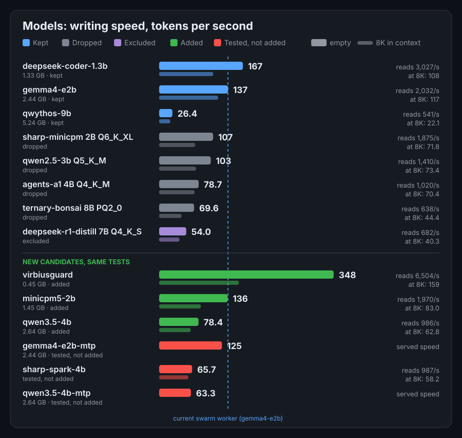
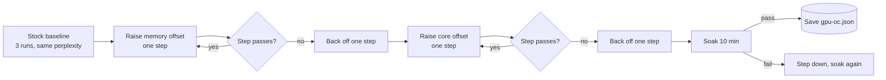

<div align="center">

# Wrekt-llama.cpp

**llama.cpp tuned for a 6 GB GTX 1660 Ti and a Ryzen 5 7600X.** Every change here was measured on that one machine, then kept or dropped on the numbers.


[Assessment](local-tune/archive/ASSESSMENT.md) · [Full report](local-tune/archive/report.html) · [Unified record](local-tune/UNIFIED.md) · [Every trial](local-tune/UNIFIED.md) · [Overclock kit](local-tune/oc-kit/AGENT.md)

</div>

> [!NOTE]
> Numbers are single passes of 3 repetitions on one card; differences under about 3% are noise.

## Where this comes from

| Project | What it is |
|---|---|
| [llama.cpp](https://github.com/ggml-org/llama.cpp) | The original project. Build, usage and backend documentation are in [docs/](docs/). |
| [Oddly-llama.cpp](https://github.com/cpntodd/Oddly-llama.cpp) | The fork this repository is based on. It adds Intel Arc and other backend work. |
| Wrekt-llama.cpp | This repository: the Oddly-llama.cpp code plus the changes, tools and measurements below, all in [local-tune/](local-tune/). |

The README that came with the code is folded away [at the end of this page](#readme-of-llamacpp).

## What is different here

| # | Change | Effect | Where |
|---|---|---|---|
| 1 | CUDA: stop using tensor-core kernels on GTX 16xx (no tensor cores, only emulated) | prompt reading 2.9x to 4.2x faster | [change 1](local-tune/UNIFIED.md#4-change-ledger) |
| 2 | qwen35: skip the fused raw-gate GDN path on CPU layers (x86) | 9B hybrid and CPU decode 20-35% faster | [change 2](local-tune/UNIFIED.md#4-change-ledger) |
| 3 | CUDA: build the q8_0 K / q4_0 V attention pair by default | 7B fits all layers at 16K, writing 11-16% faster | [change 3](local-tune/UNIFIED.md#4-change-ledger_0-k--q4_0-v-attention-pair) |
| 4 | Runtime settings: more GPU layers, `ngram-simple` speculative decoding | 9B code edits 7.0x, 3B 3.2x; 7B +37% to +57% | [trials 2](local-tune/UNIFIED.md) |
| 5 | GPU overclock (memory +2300, core +105, 120 W), found by an automated stability sweep | 7B decode 43.8 to 50.7 t/s | [overclock](#overclock-found-by-script-checked-by-perplexity) |

<details>
<summary><b>All 26 measured changes of 2026-10-06, with verdicts</b></summary>

<br>

| # | Time | Change | Verdict | Headline |
|---|---|---|---|---|
| A1 | 01:47-02:12 | GPU layers after the display moved to the iGPU | Applied | 9B +15% at 0K, 7B +37% at 0K |
| A2 | 02:18-02:32 | ngram-simple speculative decoding on code edits | Applied | 9B edit 7.0x, 3B edit 3.2x, open question unchanged |
| A3 | 02:18 | ngram-simple lookup length and map variants | No gain | defaults kept |
| A4 | 02:26 | Draft-model speculative decoding (draft-simple) | No-go | best 1.7x on code, up to 68% slower elsewhere |
| A5 | 01:47-01:53 | Fusion disabled (GGML_CUDA_DISABLE_FUSION=1) | No-go | decode 1-9% slower |
| A6 | 01:51-01:54 | Larger physical batch (-ub 1024 / 2048) | No gain | +1.5-3% for 70-900 MiB of VRAM |
| A7 | 01:56 | Host-side switches on the 9B hybrid | No gain | all within 20.5-21.3 t/s |
| A8 | 02:20-02:21 | GGML_CUDA_GRAPH_OPT=1 under server load | No gain | 139.4 vs 139.2 t/s |
| B1 | 09:12-09:57 | KV cache: K at q8_0, V at q4_0 on the 7B | Applied | +11% at 0K, +16% at 15K, perplexity +0.02 |
| B2 | 09:39 | K at q4_0 on the 7B | No-go | perplexity 8.17 to 1534 |
| B3 | 10:03-10:12 | KV mixing and --fit on the 9B / 7B | No gain | 9B perplexity flat across KV types; --fit needs -fitt 512 |
| C1 | 11:20 | ik_llama.cpp as an upper bound | No-go | prompt reading 3.6x slower, writing equal or slower |
| C2 | 11:28-11:36 | DFlash draft head for the 9B | No-go | 1.8x over a slow baseline, nothing over a layer count |
| D1 | 12:11-12:19 | 9B at -ngl 26 / 27 with K q8_0, V q4_0, 16K context | Not applied | -ngl 26 stable, +4% at 0K; not applied |
| D2 | 12:24 | ngram-simple lookup n=24 on the 7B, 2000-token answers | Not applied | 2.2x on edit with the same text; refactor still differs |
| E1 | 12:29-12:39 | System switches: power limit, locked clocks, memory offset, huge pages | No gain | none beat the stock run; 100 W costs 1-3% |
| F1 | 12:50-13:22 | Overclock, first sweep at a 100 W limit | Saved | 43.8 to 47.5 t/s (+8%), memory to +1500 cap, core limit +120 |
| F2 | 13:25-13:46 | Overclock resumed at 120 W, upward only | Saved | 50.7 t/s, +16% over stock at 100 W; saved mem +2300, core +105 |
| G1 | 13:56 | Full local-model benchmark, current state | Reference | +5-14% over the 11:21 run, probably from the overclock |
| H1 | evening | Guard verdict read from one token | Applied | tool-call check about 45 ms with the prompt cached, same verdicts on all 34 cases |
| H2 | evening | Physical batch size on the 4B (-ub 256 to 2048) | No gain | 955 to 971 t/s for every value |
| H3 | evening | Slot count on MiniCPM and the guard | Not applied | long output 322 to 659 t/s at 8 to 32 slots, routing falls from 24.4 to 18.0 items/s |
| H4 | evening | Link-time optimisation build | No gain | guard on CPU 127 vs 127 t/s, 4B on GPU unchanged |
| H5 | evening | Sampling on the GPU (-bs) | No gain | every model within 3% |
| H6 | evening | Matrix-vector kernel shape (1, 4, 8 warps) | No gain | 2 warps, the current value, is fastest on all three models |
| H7 | evening | Output layer limited to the allowed tokens | No-go | dropped before any code: about 2-3% of a guard or routing request |

Verdicts: **Applied** is in the gateway settings or the build. **Saved** is a stored overclock state. **No gain** and **No-go** were measured and dropped. **Not applied** worked but was left out with a reason, see [TRIALS.md](local-tune/UNIFIED.md).

</details>

## Models and job checks

Eight models are served through one gateway ([`gateway.py`](local-tune/scripts/gateway.py), one `models.conf` line each). [`suite.py`](local-tune/scripts/suite.py) measures each one three ways: raw speed, speed through the gateway, and small fixed job checks from [`jobs.py`](local-tune/scripts/jobs.py). The [assessment](local-tune/archive/ASSESSMENT.md) is generated from those result files.



| Model | Job | Writes | Reads | All slots | Job checks |
|---|---|---|---|---|---|
| qwen3.5-4b (added) | agent, tool calls, code | 78.4 t/s | 986 t/s | | tools 6/6, code 4/4 |
| minicpm5-2b (added) | routing, tool calls | 136 t/s | 1,970 t/s | 305 t/s (8) | routing 16/16, tools 6/6 |
| virbiusguard (added) | checks every tool call before it runs | 348 t/s | 6,504 t/s | 640 t/s (4) | attacks 11/12, no safe input blocked |
| gemma4-e2b | swarm worker | 137 t/s | 2,032 t/s | 349 t/s (8) | routing 16/16, tools 6/6 |
| qwythos-9b | large model, 25 layers on the GPU | 26.4 t/s | 541 t/s | | tools 6/6, code 3/4 |
| deepseek-coder-1.3b | code completion | 167 t/s | 3,027 t/s | 465 t/s (4) | code 3/4 |

Embedding (embeddinggemma-300m, 454 items/s) and reranking (qwen3-reranker-0.6b, 38.9 items/s) are served too. Three more candidates were tested and not added; the assessment lists them with the reasons. Speeds are from the suite run with every model on the GPU; the guard was moved to the CPU afterwards.

<details>
<summary><b>The guard verdict, and what the backend plan found</b></summary>

<br>

- **One-token verdict.** The guard prompt ends with `{"hit_rule":` and the request asks for one token with its probabilities. The probability of `true` against a limit of 0.5 is the verdict. A check takes about 45 ms with the prompt cached (214 to 239 ms before), with the same verdict on all 34 test cases. The guard runs on the CPU, so it never pushes the agent model out of VRAM.
- **Known misses.** Two attack tool calls score under 0.001 and pass, and one safe call scores 0.54 and is flagged. No limit beats 0.5 on the test set (30 of 34).
- **Backend plan.** Six backend changes for the added models were planned with a goal, a baseline rerun and a pass rule each ([BACKEND-PLAN.md](local-tune/UNIFIED.md)). None was kept: rows H2 to H7 above, details in [TRIALS.md, section 2e](local-tune/UNIFIED.md).
- **Where the time goes.** The 4B writes at 77% of the card's memory rate (222 of 288 GB/s), so little is left in the kernels. The small models are limited by fixed cost per token, which more slots recover.

</details>

## Overclock, found by script, checked by perplexity

Raising GPU clocks can corrupt output silently, so a speed number alone proves nothing. [`gpu-push.py`](local-tune/scripts/gpu-push.py) raises one offset at a time and judges every step on five checks, then runs a soak test before it saves anything.




| | Stock, 100 W | Saved |
|---|---|---|
| 7B decode, 4K context | 43.8 t/s | **50.7 t/s (+16%)** |
| Memory offset | 0 (6001 MHz) | +2300 (6900 MHz) |
| Core offset | 0 | +105 (limit +120, +135 fails) |
| Power limit | 100 W | 120 W (range 70-120 W) |
| Soak | | 14 of 14 passes, perplexity 12.8239 every time, 73-75 C |

<details>
<summary><b>How a step is judged, and what the two runs did</b></summary>

<br>

- Clean exit, and no new `NVRM: Xid` line in the kernel log.
- Perplexity equal to the stock value digit for digit. The run is deterministic, so one flipped bit moves it. Core +135 failed this way in both runs (12.8248, then 12.8234).
- Decode speed not under 93% of the best so far, because GDDR6 retries bad transfers and that shows as lost speed before it shows as errors.
- Temperature under 83 C. A hang or timeout counts as a failure.

1. **100 W run.** Memory reached its +1500 cap with no limit found, core stopped at +120. Saved +1400 / +105 after 13 soak passes: 43.8 to 47.5 t/s (+8%).
2. **120 W run, `--resume`.** Re-verified the saved pair, raised the power limit, then swept upward only. The pair held at 49-50 t/s (about +5% from the power limit alone), memory went to +2400 with no failure. Saved +2300 / +105 after 14 soak passes.

Offsets live in the driver only: a reboot or a crash returns them to 0, and a hard hang needs the power button. The state file is written only after the final soak passes. It is per machine and not tracked in git.

</details>

<details>
<summary><b>Run it on your own GPU</b></summary>

<br>

```sh
python3 local-tune/scripts/gpu-push.py --mem-max 1500 --core-max 300 --power 120   # first run
python3 local-tune/scripts/gpu-push.py --resume --power 120 --mem-max 2400         # later, upward only
python3 local-tune/scripts/gpu-push.py apply                                       # after each reboot
python3 local-tune/scripts/gpu-push.py reset                                       # back to stock
```

It needs the proprietary NVIDIA driver, `sudo`, a GGUF that fits in VRAM and a fixed text file for the perplexity check. [`local-tune/oc-kit/AGENT.md`](local-tune/oc-kit/AGENT.md) lists every hardcoded value to change for another machine, written so an AI agent can make the edits. It can hang the machine, so save your work first.

</details>

## Where the speed came from, in one table

| Setting | Before | After | Why it works |
|---|---|---|---|
| 9B code edit, `--spec-type ngram-simple` | 24.1 t/s | 169.6 t/s | Copies text the model already wrote. Output matched the run without it. |
| 7B, 15K context | 18.2 t/s | 32.9 t/s | All layers on the GPU plus K at q8_0 and V at q4_0 frees about 130 MiB at 16K. |
| 7B, K at q4_0 | perplexity 8.17 | 1534 | Rejected. Quantising K below 8 bits breaks this model. |
| Draft-model speculation | 88.4 t/s | 28.3-72.4 t/s | Rejected. 18-68% slower on open questions. |
| ik_llama.cpp | 3036 t/s prompt | 844 t/s | Rejected. No gain over this tree. |

<details>
<summary><b>Reproduce and keep it healthy</b></summary>

<br>

- `python3 local-tune/scripts/lab.py auto` reruns the checks that cover a source file when it changes and rewrites the results page.
- `local-tune/scripts/bench.sh <build-dir> <label>` runs the four standard models; `compare.py`, `ppl.py` and `spectest.py` run A/B, perplexity and server-side trials. See [local-tune/UNIFIED.md](local-tune/UNIFIED.md#4-change-ledger).
- `python3 local-tune/scripts/suite.py run <name>` tests every model in `models.conf` (speed, served speed, job checks); `python3 local-tune/scripts/assess.py <new> <base>` writes the [assessment](local-tune/archive/ASSESSMENT.md) and its picture.
- `python3 local-tune/scripts/watch.py` is the live terminal view of whatever run is newest.
- The interactive [report](local-tune/archive/report.html) has the same data with expandable changes and hover charts. Open it locally in a browser, or through an HTML previewer such as `https://htmlpreview.github.io/?https://github.com/TheCascadian/Wrekt-llama.cpp/blob/master/local-tune/archive/report.html`.

</details>

## Build

```sh
local-tune/scripts/build.sh        # Release, CUDA for sm_75, native CPU flags
```

Other platforms and backends build as in llama.cpp: [docs/build.md](docs/build.md). The license is MIT, as upstream ([LICENSE](LICENSE), [AUTHORS](AUTHORS)).

## README of llama.cpp

The README that came with the code, unchanged, as carried by the [Oddly-llama.cpp](https://github.com/cpntodd/Oddly-llama.cpp) fork.

<details>
<summary><b>Show the llama.cpp README</b></summary>

<br>

# llama.cpp

> [!IMPORTANT]
> **This is the PrismML fork of llama.cpp**, the main line behind the [Bonsai](https://huggingface.co/collections/prism-ml/bonsai) models (branch `prism`, developed as `prism-v7`). It tracks current mainline llama.cpp and adds the fork's low-bit formats and runtime features on top.
>
> **New here? Start with the [Bonsai-demo](https://github.com/PrismML-Eng/Bonsai-demo) repo.** It downloads the right models and the correct prebuilt binaries for your hardware/backend automatically.
>
> **Which ternary model file to use:**
>
> - `*-PQ2_0.gguf` (fork group-128, ggml id 142): preferred on Metal, CUDA, HIP and CPU. About 6% smaller than group-64.
> - `*-Q2_0_g64.gguf` / 27B `*-Q2_g64.gguf` (official group-64, ggml id 42): runs on every backend here AND on mainline llama.cpp. If unsure, use this. Newer model releases name this file plain `*-Q2_0.gguf`.
> - `*-Q2_0.gguf` on OLDER model repos is the **deprecated legacy format** (group 128 stored as id 42). It does not load on these builds; the error tells you which file to get instead. If you must run it, use the frozen [`prism-v5`](https://github.com/PrismML-Eng/llama.cpp/tree/prism-v5) line and its final release [`prism-b9601`](https://github.com/PrismML-Eng/llama.cpp/releases/tag/prism-b9601-68faa14).
>
> **Speculative decoding (dspark)** is supported via mainline's draft-dspark plus fork patches. Drafters published for older model releases need a one-time conversion with `gguf-dspark-to-dflash` (see [SPECULATIVE.md](https://github.com/PrismML-Eng/Bonsai-demo/blob/main/SPECULATIVE.md) in Bonsai-demo); newer releases ship ready-to-use drafters.
>
> Do NOT build from `prism-v6` (stale mid-migration snapshot) and do NOT mix this fork's `ggml-*` libraries with a stock llama.cpp build.

---


<div align="center">

<b>LLM inference in C/C++</b>

[](https://opensource.org/licenses/MIT)
[](https://github.com/ggml-org/llama.cpp/releases?q=tag:v0)
[](https://github.com/ggml-org/llama.cpp/releases?q=b)
[](https://github.com/ggml-org/llama.cpp/actions/workflows/server.yml)
[](https://github.com/ggml-org/llama.cpp/actions/workflows/docker.yml)
[](https://github.com/ggml-org/llama.cpp/actions/workflows/winget.yml)

[ggml](https://github.com/ggml-org/ggml) / [ops](https://github.com/ggml-org/llama.cpp/blob/master/docs/ops.md) / [maintainer PRs](https://github.com/ggml-org/llama.cpp/issues?q=is%3Apr%20is%3Aopen%20draft%3AFalse%20(author%3Argerganov%20OR%20author%3AKitaitiMakoto%20OR%20author%3Adanbev%20OR%20author%3Aaldehir%20OR%20author%3Amax-krasnyansky%20OR%20author%3ACISC%20OR%20author%3Aggerganov%20OR%20author%3Aam17an%20OR%20author%3Abartowski1182%20OR%20author%3Anikwen%20OR%20author%3Ahipudding%20OR%20author%3AServeurpersoCom%20OR%20author%3Apwilkin%20OR%20author%3Areeselevine%20OR%20author%3Angxson%20OR%20author%3Ajeffbolznv%20OR%20author%3Amarty1885%20OR%20author%3A0cc4m%20OR%20author%3ATitaniumtown%20OR%20author%3Aangt%20OR%20author%3AIMbackK%20OR%20author%3Aarthw%20OR%20author%3AJohannesGaessler%20OR%20author%3AORippler%20OR%20author%3Aruixiang63%20OR%20author%3Axctan%20OR%20author%3Aallozaur%20OR%20author%3Ayomaytk%20OR%20author%3Aaendk%20OR%20author%3Agaugarg-nv%20OR%20author%3Ataronaeo%20OR%20author%3Aforforever73%20OR%20author%3Alhez%20OR%20author%3Anetrunnereve%20OR%20author%3Afairydreaming)%20sort%3Aupdated-desc) / [dev stats](https://github.com/ggml-org/llama.cpp-dev) / [lib llama API](https://github.com/ggml-org/llama.cpp/issues/9289) / [llama-server REST API](https://github.com/ggml-org/llama.cpp/issues/9291)

</div>

## Quick start

A few options to get `llama.cpp` installed on your machine:

- Visit https://llama.app and follow the instructions
- Run with Docker - see our [Docker documentation](docs/docker.md)
- Download pre-built binaries from the [releases page](https://github.com/ggml-org/llama.cpp/releases)
- Build from source by cloning this repository - check out [our build guide](docs/build.md)

Once installed:

```sh
# Download and run a model directly from Hugging Face
llama cli -hf ggml-org/Qwen3.5-0.8B-GGUF

# Launch OpenAI-compatible API server
llama serve -hf ggml-org/Qwen3.5-0.8B-GGUF
```

<table align="center">
    <tr>
        <td align="center" width=50%>
            
            <i>VLM session with <b>llama cli</b></i>
        </td>
        <td align="center">
            
            <i>Built-in web UI against <b>llama serve</b></i>
        </td>
    </tr>
<table>

## Description

The main goal of `llama.cpp` is to enable LLM (and VLM) inference with minimal setup and state-of-the-art performance on
a wide range of hardware - locally and in the cloud.

- Plain C/C++ implementation without any dependencies
- Apple silicon is a first-class citizen - optimized via ARM NEON, Accelerate and Metal frameworks
- AVX, AVX2, AVX512 and AMX support for x86 architectures
- RVV, ZVFH, ZFH, ZICBOP and ZIHINTPAUSE support for RISC-V architectures
- 1.5-bit, 2-bit, 3-bit, 4-bit, 5-bit, 6-bit, and 8-bit integer quantization for faster inference and reduced memory use
- Custom CUDA kernels for running LLMs on NVIDIA GPUs (support for AMD GPUs via HIP and Moore Threads GPUs via MUSA)
- Vulkan and SYCL backend support
- CPU+GPU hybrid inference to partially accelerate models larger than the total VRAM capacity

The `llama.cpp` project is build on top of the [ggml](https://github.com/ggml-org/ggml) library.

## Supported backends

| Backend | Target devices |
| --- | --- |
| [BLAS](docs/build.md#blas-build) | All |
| [BLIS](docs/backend/BLIS.md) | All |
| [CANN](docs/build.md#cann) | Ascend NPU |
| [CUDA](docs/build.md#cuda) | Nvidia GPU |
| [HIP](docs/build.md#hip) | AMD GPU |
| [Hexagon [In Progress]](docs/backend/snapdragon/README.md) | Snapdragon |
| [IBM zDNN](docs/backend/zDNN.md) | IBM Z & LinuxONE |
| [MUSA](docs/build.md#musa) | Moore Threads GPU |
| [Metal](docs/build.md#metal-build) | Apple Silicon |
| [OpenCL](docs/backend/OPENCL.md) | Adreno GPU |
| [OpenVINO [In Progress]](docs/backend/OPENVINO.md) | Intel CPUs, GPUs, and NPUs |
| [RPC](https://github.com/ggml-org/llama.cpp/tree/master/tools/rpc) | All |
| [SYCL](docs/backend/SYCL.md) | Intel GPU |
| [VirtGPU](docs/backend/VirtGPU.md) | VirtGPU APIR |
| [Vulkan](docs/build.md#vulkan) | GPU |
| [WebGPU](docs/build.md#webgpu) | All |
| [ZenDNN](docs/build.md#zendnn) | AMD CPU |

## Documentation

#### Tools

- [cli](tools/cli/README.md)
- [completion](tools/completion/README.md)
- [server](tools/server/README.md)
- [GBNF grammars](grammars/README.md)

#### Development

- [How to build](docs/build.md)
- [Running on Docker](docs/docker.md)
- [Build on Android](docs/android.md)
- [Multi-GPU usage](docs/multi-gpu.md)
- [Performance troubleshooting](docs/development/token_generation_performance_tips.md)
- [GGML tips & tricks](https://github.com/ggml-org/llama.cpp/wiki/GGML-Tips-&-Tricks)
- [XCFramework](docs/xcframework.md)
- [Completions](docs/completions.md)
- [Models](docs/models.md)
- [Release process](docs/release.md)

## Contributing

- Contributors can open PRs
- Collaborators will be invited based on contributions
- Maintainers can push to branches in the `llama.cpp` repo and merge PRs into the `master` branch
- Any help with managing issues, PRs and projects is very appreciated!
- Read the [CONTRIBUTING.md](CONTRIBUTING.md) for more information

## Acknowledgements

- [yhirose/cpp-httplib](https://github.com/yhirose/cpp-httplib) - Single-header HTTP server, used by `llama-server` - MIT license
- [nothings/stb](https://github.com/nothings/stb) - Single-header image format decoder, used by multimodal subsystem - Public domain
- [nlohmann/json](https://github.com/nlohmann/json) - Single-header JSON library, used by various tools/examples - MIT License
- [mackron/miniaudio](https://github.com/mackron/miniaudio) - Single-header audio format decoder, used by multimodal subsystem - Public domain
- [sheredom/subprocess.h](https://github.com/sheredom/subprocess.h) - Single-header process launching solution for C and C++ - Public domain

</details>
