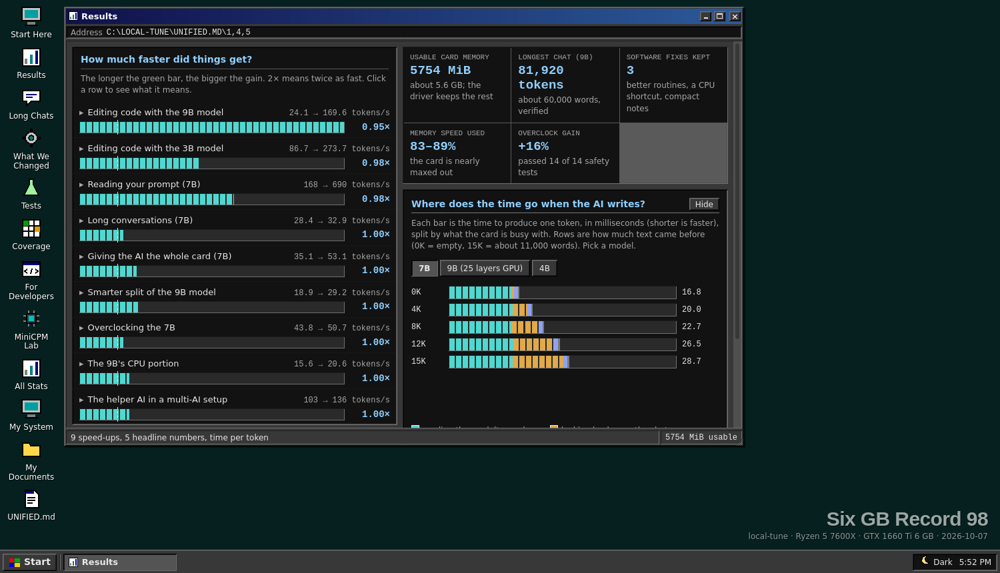
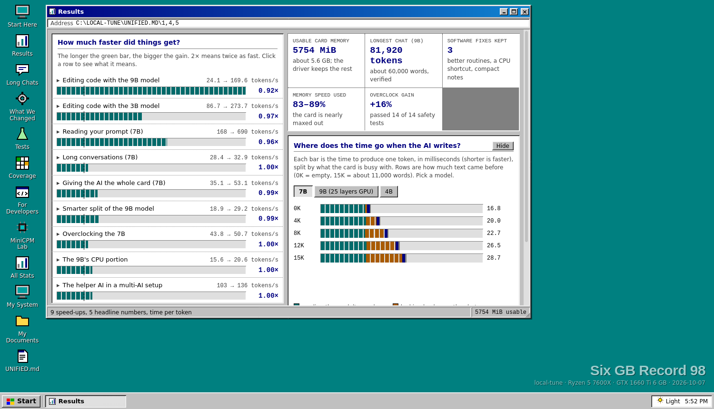
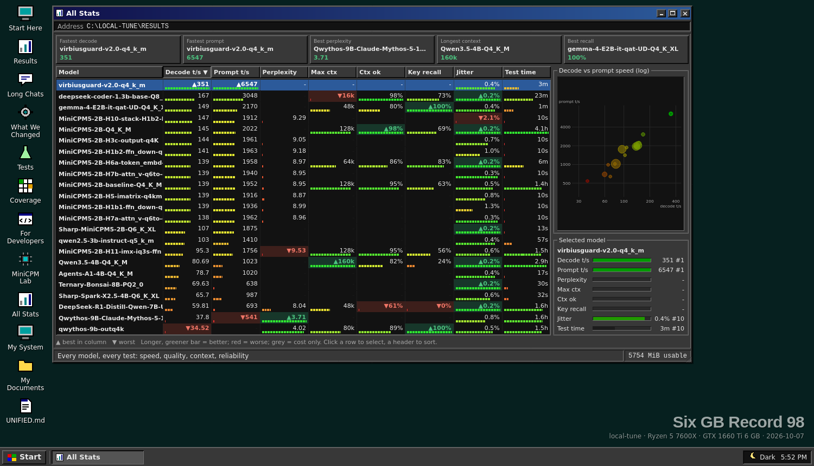
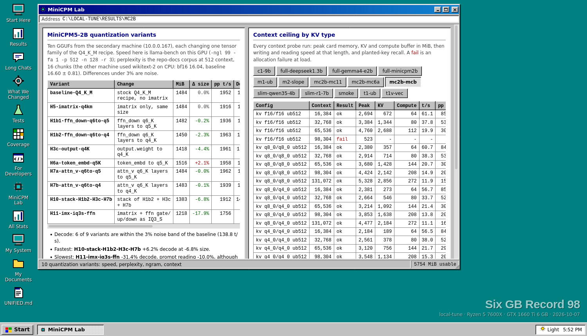
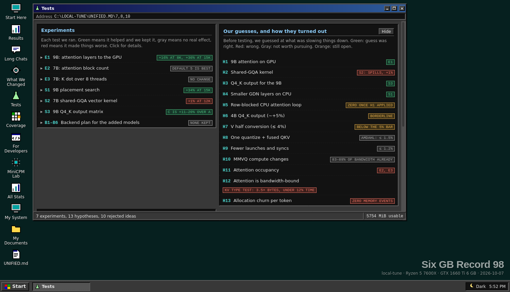

# local-tune

Tuning a llama.cpp fork for a Ryzen 5 7600X + GTX 1660 Ti (6 GB, Turing, no tensor cores). Three kept code changes (GTX 16xx kernel selection, qwen35 GDN CPU path, q8_0 K / q4_0 V pair), a GPU overclock and gateway settings. Prompt reading is 2.9x to 4.2x faster, 9B code edits 7.0x with ngram speculation, and the 9B holds 81,920 tokens of context at q4/q4 `-ub 128`.

Everything measured is in **[UNIFIED.md](UNIFIED.md)** (page version: [UNIFIED.html](UNIFIED.html)). Commit timeline: [HISTORY.md](HISTORY.md).

## The record, as a Windows 98 desktop

[UNIFIED.html](UNIFIED.html) is a single self-contained page that looks like a Windows 98 desktop. Every section of the record is a window you can drag, minimize and maximize, with a Start menu, taskbar, a Notepad holding the full UNIFIED.md, a file explorer over every csv and plan, and a light/dark theme switch (Windows Standard or High Contrast Black).

| | |
|---|---|
|  |  |
| **Results**: speed-ups and time per token, dark and light themes | **Results** again in Windows Standard |
|  |  |
| **All Stats**: every model and test on one sortable chart (green best, red worst) | **MiniCPM Lab**: quantization variants and context ceilings |



After new results land, run `python3 local-tune/scripts/embed-unified.py` to refresh the data inside the page.

## Run it yourself

```
cp local-tune/config/models.example.conf local-tune/config/models.conf   # list your GGUF files
python3 local-tune/scripts/gateway.py &                 # serves them on :8700
python3 local-tune/scripts/watch.py                     # live view, second terminal
python3 local-tune/scripts/suite.py run base            # speed, served speed, job checks
python3 local-tune/scripts/suite.py run next
python3 local-tune/scripts/assess.py next base          # writes archive/ASSESSMENT.md and img/*.svg
python3 local-tune/scripts/ctxprobe.py run <plan>       # context ceiling
```

## Directory map

| Path | Contents |
|---|---|
| `scripts/` | all code: gateway, suite, assess, compare, ppl, spectest, lab, ctxprobe, gpu-push, paths.py |
| `config/` | `assess.conf`, `suites.conf`, `models.example.conf` (`models.conf` is git-ignored) |
| `results/<family>/` | throughput, kv, speculative, quality, profiling, context, hardware, suites, lab |
| `prof/` | CUPTI tracer, plans, analysis |
| `img/` | generated charts and UNIFIED.html screenshots |
| `archive/` | superseded documents, each with a header |
| `oc-kit/`, `oc-kit.*` | standalone overclock kit for another machine |
| `odysseus/` | Odysseus agent-loop patch |
| `gpu-push.py` | shim for `gpu-oc.service` |
