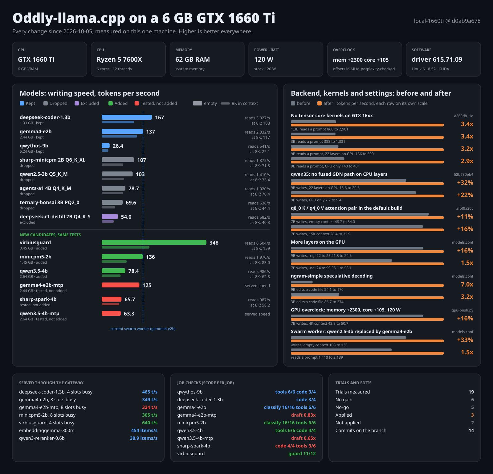

> **Superseded** by [UNIFIED.md](../UNIFIED.md) on 2026-10-07. Generated by `local-tune/scripts/assess.py`; kept as a snapshot of the machine and the commit list.
> Commands below that name `local-tune/<script>` now live in `local-tune/scripts/`.

# Assessment: Wrekt-llama.cpp on a 6 GB GTX 1660 Ti

State of the machine and of every change since 2026-10-05. Generated by `local-tune/scripts/assess.py` from `local-tune/results/`; do not edit by hand, run it again.
All speeds are tokens per second on this one machine. Higher is better. Differences under about 3% are noise.



## Machine

| Part | Value |
|---|---|
| GPU | GTX 1660 Ti, 6144 MiB, driver 615.71.09 |
| CPU | AMD Ryzen 5 7600X, 6 cores, 12 threads |
| RAM | 62 GB |
| Power limit | 120 W (stock 120 W) |
| Overclock | memory +2300 MHz, core +105 MHz, saved 1006-1325 |
| Build | branch `master` at `648f6c3f7`, Linux 6.18.52-1-cachyos-lts |

## Changes, before and after

| Area | Change | Measured on | Before | After | Gain | Where | Result files |
|---|---|---|---|---|---|---|---|
| Kernel | No tensor-core kernels on GTX 16xx | 1.3B reads a prompt | 860 | 2,901 | **3.4x** | `a260d811e` | `final-base, final-fix` |
| Kernel | No tensor-core kernels on GTX 16xx | 3B reads a prompt | 388 | 1,331 | **3.4x** | `a260d811e` | `final-base, final-fix` |
| Kernel | No tensor-core kernels on GTX 16xx | 9B reads a prompt, 22 layers on GPU | 156 | 500 | **3.2x** | `a260d811e` | `final-base, final-fix` |
| Kernel | No tensor-core kernels on GTX 16xx | 9B reads a prompt, CPU only | 140 | 401 | **2.9x** | `a260d811e` | `final-base, final-fix` |
| Backend | qwen35: no fused GDN path on CPU layers | 9B writes, 22 layers on GPU | 15.6 | 20.6 | **+32%** | `52b730eb4` | `base, patched` |
| Backend | qwen35: no fused GDN path on CPU layers | 9B writes, CPU only | 7.7 | 9.4 | **+22%** | `52b730eb4` | `base, patched` |
| Kernel | q8_0 K / q4_0 V attention pair in the default build | 7B writes, empty context | 48.7 | 54.0 | **+11%** | `afbf9a20c` | `kvmix-7b-confirm, kvmix-7b-confirm` |
| Kernel | q8_0 K / q4_0 V attention pair in the default build | 7B writes, 15K context | 28.4 | 32.9 | **+16%** | `afbf9a20c` | `kvmix-7b-confirm, kvmix-7b-confirm` |
| Settings | More layers on the GPU | 9B writes, -ngl 22 to 25 | 21.3 | 24.6 | **+16%** | `models.conf` | `ngl-9b-16k, ngl-9b-16k` |
| Settings | More layers on the GPU | 7B writes, -ngl 24 to 99 | 35.1 | 53.1 | **1.5x** | `models.conf` | `ngl-7b-16k, ngl-7b-16k` |
| Settings | ngram-simple speculative decoding | 9B edits a code file | 24.1 | 170 | **7.0x** | `models.conf` | `edit-qwythos9b, edit-qwythos9b` |
| Settings | ngram-simple speculative decoding | 3B edits a code file | 86.7 | 274 | **3.2x** | `models.conf` | `tune-qwen3b, tune-qwen3b` |
| Hardware | GPU overclock: memory +2300, core +105, 120 W | 7B writes, 4K context | 43.8 | 50.7 | **+16%** | `gpu-push.py` | `gpupush-1006-1250, gpupush-1006-1325` |
| Models | Swarm worker: qwen2.5-3b replaced by gemma4-e2b | writes, empty context | 103 | 136 | **+33%** | `models.conf` | `newmodels, newmodels` |
| Models | Swarm worker: qwen2.5-3b replaced by gemma4-e2b | reads a prompt | 1,410 | 2,139 | **1.5x** | `models.conf` | `newmodels, newmodels` |

## Models

Kept and new models were run together in suite `shortlist`. Dropped and excluded models keep their last measurement.
Write and read are llama-bench speeds with the model's own settings. One chat and all slots are measured through the gateway.


| Model | Status | File | Writes | Writes at 8K | Reads | One chat | All slots | Items/s | VRAM | Note |
|---|---|---|---|---|---|---|---|---|---|---|
| deepseek-coder-1.3b | Kept | 1.33 GB | 167 | 108 | 3,027 | 183 | 465 (4) | - | 3,155 MiB | ngram-simple.  |
| gemma4-e2b | Kept | 2.44 GB | 137 | 117 | 2,032 | 132 | 349 (8) | 18.9 | 1,587 MiB | forced-label classify |
| qwythos-9b | Kept | 5.24 GB | 26.4 | 22.1 | 541 | 26.1 | - | - | 4,322 MiB | ngram-simple.  |
| embeddinggemma-300m | Kept | 0.31 GB | - | - | - | - | - | 454 | 428 MiB | 768 dimensions |
| qwen3-reranker-0.6b | Kept | 0.6 GB | - | - | - | - | - | 38.9 | 1,896 MiB | right document ranked first |
| virbiusguard | Added | 0.45 GB | 348 | 159 | 6,504 | 313 | 640 (4) | - | 1,388 MiB |  |
| minicpm5-2b | Added | 1.45 GB | 136 | 83.0 | 1,970 | 133 | 305 (8) | 23.9 | 2,125 MiB | forced-label classify |
| qwen3.5-4b | Added | 2.64 GB | 78.4 | 62.8 | 986 | 77.6 | - | - | 3,151 MiB | ngram-simple.  |
| gemma4-e2b-mtp | Tested, not added | 2.44 GB | 125 | - | - | 125 | 324 (8) | 15.3 | 1,909 MiB | draft-mtp. MTP drafter: 0.83x speed and the text changed |
| sharp-spark-4b | Tested, not added | - | 65.7 | 58.2 | 987 | 65.3 | - | - | 4,038 MiB | ngram-simple. tool calls 3 of 6; slower than qwen3.5-4b and 900 MiB larger |
| qwen3.5-4b-mtp | Tested, not added | 2.64 GB | 63.3 | - | - | 63.3 | - | - | 3,688 MiB | draft-mtp. MTP drafter: 0.65x speed |
| sharp-minicpm 2B Q6_K_XL | Dropped | - | 107 | 71.8 | 1,875 | - | - | - | - | lost the first candidate round, file deleted |
| qwen2.5-3b Q5_K_M | Dropped | - | 103 | 73.4 | 1,410 | - | - | - | - | replaced by gemma4-e2b as the swarm worker |
| agents-a1 4B Q4_K_M | Dropped | - | 78.7 | 70.4 | 1,020 | - | - | - | - | lost the first candidate round, file deleted |
| ternary-bonsai 8B PQ2_0 | Dropped | - | 69.6 | 44.4 | 638 | - | - | - | - | lost the first candidate round, file deleted |
| deepseek-r1-distill 7B Q4_K_S | Excluded | - | 54.0 | 40.3 | 682 | - | - | - | - | still served, left out of the suite runs on request |

## Job checks

Small fixed tests from `jobs.py`. They show if a model can do the job at all; they do not rank two models that both pass.

| Model | Status | Job | Score | Detail |
|---|---|---|---|---|
| deepseek-coder-1.3b | Kept | Writes code | **3/4** | functions that pass their asserts |
| gemma4-e2b | Kept | Routes requests | **16/16** | 7.9 items/s |
| gemma4-e2b | Kept | Calls tools | **6/6** | every call valid |
| qwythos-9b | Kept | Calls tools | **6/6** | every call valid |
| qwythos-9b | Kept | Writes code | **3/4** | functions that pass their asserts |
| virbiusguard | Added | Blocks attacks | **11/12** | 1 attacks missed; 0 safe inputs blocked; 151 ms per verdict |
| minicpm5-2b | Added | Routes requests | **16/16** | 10.5 items/s |
| minicpm5-2b | Added | Calls tools | **6/6** | every call valid |
| qwen3.5-4b | Added | Calls tools | **6/6** | every call valid |
| qwen3.5-4b | Added | Writes code | **4/4** | functions that pass their asserts |
| gemma4-e2b-mtp | Tested, not added | Drafter speed-up | **0.83x** | TEXT DIFFERS; one stream 133 to 110 t/s; 8 slots 340 to 288 t/s |
| sharp-spark-4b | Tested, not added | Writes code | **4/4** | functions that pass their asserts |
| sharp-spark-4b | Tested, not added | Calls tools | **3/6** | missed run_shell create_document read_file |
| qwen3.5-4b-mtp | Tested, not added | Drafter speed-up | **0.65x** | same text; one stream 78 to 51 t/s |

## Trials

26 trials have a verdict in the [README](../../README.md): 4 applied, 10 no gain, 6 no-go, 3 not applied, 2 saved, 1 reference. Each one is described in [TRIALS.md](TRIALS.md).

## Edits without a speed number

| Area | What changed |
|---|---|
| Gateway | Source moved into this repo (local-tune/gateway.py); the Odysseus folder links to it. New GET /conf and a jobs column in models.conf |
| Gateway | models.conf is the one model list: gateway, suite.py and assess.py read it, nothing else names a model path |
| Swarm | MCP swarm server (votes, choices) uses gemma4-e2b with 8 slots as the worker |
| Odysseus | agent_loop.py: browser tools are gated, documents are created strictly for gemma (local patch, not in the image) |
| Catalog | 927 small GGUF models collected from Hugging Face with their cards; 16 shortlisted, 5 downloaded and tested here; 3 added (qwen3.5-4b, minicpm5-2b, virbiusguard) |
| Tooling | suite.py phase 3: job checks (jobs.py) for routing, tool calls, code, guard verdicts and drafters |
| Guard | virbiusguard checks every Odysseus tool call; it moved to the CPU after the suite run, so it never evicts the agent model |
| Guard | Verdict from one token: a tool-call check takes about 45 ms with the prompt cached (TRIALS.md, section 2e); the suite numbers for the guard are from the GPU setting |
| Backend | Six backend changes for the added models were tried and none was kept (BACKEND-PLAN.md) |

## Commits in the period

| Commit | When | Subject |
|---|---|---|
| `648f6c3f7` | 10-07 04:31 | local-tune: group results by family (throughput, kv, speculative, quality, profiling, context, hardware, suites, lab) |
| `d1f4e46c9` | 10-07 04:31 | local-tune: move scripts to scripts/ and config files to config/ (paths fixed in the next commits) |
| `6316d717c` | 10-07 04:28 | local-tune: snapshot before consolidation - discovery report, profiling tools, context probe, round 1-2 results |
| `d954ac6f4` | 10-06 17:40 | Edit .gitignore to clean repo |
| `b47645cdd` | 10-06 17:33 | README: rename to Wrekt-llama.cpp, link llama.cpp and Oddly-llama.cpp, add the model and guard results, fold the upstream README |
| `f1e7c17df` | 10-06 17:23 | local-tune: one-token guard verdict and the backend plan with its trials (none kept) |
| `481d872d6` | 10-06 17:23 | local-tune: gateway in the repo, end-to-end suite with job checks, and an assessment report for the added models |
| `d0ab9a678` | 10-06 14:18 | local-tune: GPU overclock sweep (+16% decode), results report, and a branch README for local-1660ti |
| `f7c1ca43d` | 10-06 10:43 | local-tune: results page leads with a plain-language summary, technical detail collapsed |
| `45d2e13e9` | 10-06 10:36 | local-tune: document the q8_0 K / q4_0 V pair as change 3 and the 7B gateway setting |
| `bafd6a875` | 10-06 10:25 | local-tune: KV precision trials, perplexity runner, and lab.py to run the suites on source changes |
| `afbf9a20c` | 10-06 10:25 | CUDA: build the q8_0 K / q4_0 V attention pair by default |
| `328ff74bd` | 10-06 05:46 | local-tune: close out the backlog leads - ngram-simple on the 7B with long answers, draft types, blocked items |
| `e42c95cda` | 10-06 05:29 | local-tune: ledger.py builds the results page with a decision ledger and trial charts |
| `6b3297755` | 10-06 05:20 | local-tune: backlog trials - GPU layer counts, ngram-simple on code edits, draft model, switches with no gain |
| `cf14ecd26` | 10-05 23:24 | local-tune: record the trial plan, the baseline correction and the untested backlog |
| `f40988912` | 10-05 23:01 | local-tune: document the GTX 16xx kernel selection change |
| `efb8f377e` | 10-05 22:51 | local-tune: KV matrix and kernel comparison scripts with live views, timing logs and results |
| `a260d811e` | 10-05 22:51 | cuda: use non-tensor-core kernels on Turing GPUs without tensor cores |
| `155d646a0` | 10-05 19:34 | local-tune: build/bench scripts and results for Ryzen 7600X + GTX 1660 Ti |
| `52b730eb4` | 10-05 19:34 | qwen35: skip fused raw-gate GDN path on CPU-resident layers on x86 |

## Run it yourself

```
cp local-tune/config/models.example.conf local-tune/config/models.conf   # list your GGUF files
python3 local-tune/scripts/gateway.py &                             # serves them on :8700
python3 local-tune/scripts/watch.py                                 # live view, in a second terminal
python3 local-tune/scripts/suite.py run base                        # speed, served speed and job checks
# add a model line to models.conf, restart the gateway, then:
python3 local-tune/scripts/suite.py run next
python3 local-tune/scripts/assess.py next base                      # this page and the picture
```

`config/assess.conf` lists the before and after pairs. Its numbers are references to result files, so point them at your own runs.
